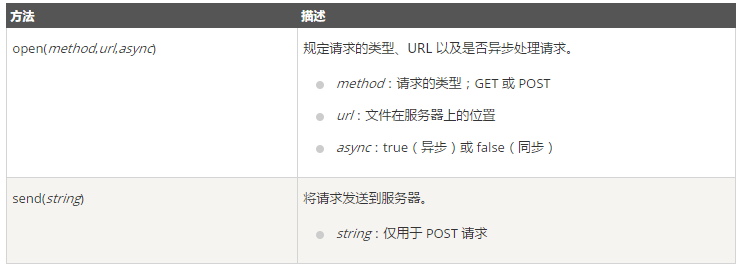
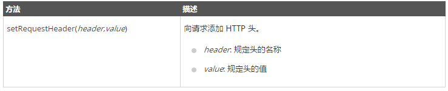
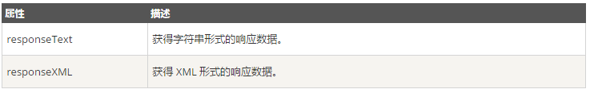

# AJAX教程

[菜鸟教程：AJAX教程](http://www.runoob.com/ajax/ajax-intro.html)

## AJAX简介

AJAX是一种无需重新加载整个网页的情况下，能够更新部分网页的技术。

### 什么是AJAX？

AJAX=异步JavaScript和XML。

AJAX是一种用于创建快速动态网页的技术。

通过在后台与服务器进行少量数据交换，AJAX可以使网页实现异步更新。这意味着可以在不重新加载整个网页情况下，对网页的某部分进行更新。

传统的网页(不使用AJAX)如果需要更新内容，必需重载整个网页面。

### AJAX工作原理


{
    var xmlhttp;
    if (window.XMLHttpRequest)
    {
        //  IE7+, Firefox, Chrome, Opera, Safari 浏览器执行代码
        xmlhttp=new XMLHttpRequest();
    }
    else
    {
        // IE6, IE5 浏览器执行代码
        xmlhttp=new ActiveXObject("Microsoft.XMLHTTP");
    }
    xmlhttp.onreadystatechange=function()
    {
        if (xmlhttp.readyState==4 && xmlhttp.status==200)
        {
            document.getElementById("myDiv").innerHTML=xmlhttp.responseText;
        }
    }
    xmlhttp.open("GET","http://www.runoob.com/try/ajax/ajax_info.txt",true);
    xmlhttp.send();
}
</script>
</head>
<body>

<div id="myDiv"><h2>使用 AJAX 修改该文本内容</h2></div>
<button type="button" onclick="loadXMLDoc()">修改内容</button>

</body>
</html>
```

### AJAX实例解析

上面的AJAX应用程序包含一个div和一个按钮

div部分用于显示来自服务器的信息。当被按钮点击时，它负责调用名为loadXMLDoc()的函数

## XHR创建对象

XMLHttpRequest是AJAX的基础。

### XMLHttpRequest对象

所有现代浏览器都支持XMLHttpRequest对象(IE5和IE6使用ActiveXObject)

XMLHttpRequest用于在后台与服务器交换数据。这意味着可以在不重新加载整个网页的情况下，对网页的某部分进行更新。

### 创建XMLHttpRequest对象

所有现代浏览器均内建XMLHttpRequest对象。

创建XMLHttpRequest对象的语法：

>variable=new XMLHttpRequest();

老版本的IE浏览器使用ActiveX对象：

>variable=new ActiveXObject("Microsoft.XMLHTTP");

为了应对所有的现代浏览器，包括IE5和IE6，请检查浏览器是否支持XMLHttpRequest对象。如果支持，则创建XMLHttpRequest对象。如果不支持，则创建ActiveXObject：

```js
var xmlhttp;
if (window.XMLHttpRequest){
    // IE7+，Firefox。Chrome，Opera，Safari 浏览器执行代码
    xmlhttp=new XMLHttpRequest();
}else{
    // IE6，IE5 浏览器执行代码
    xmlhttp=new ActiveXObject("Microsoft.XMLHTTP");
}
```

## XHR请求

### AJAX-向服务器发送请求

XMLHttpRequest对象用于和服务器交换数据

### AJAX-向服务器发送请求

如需将请求发送到服务器，我们使用XMLHttpRequest对象的open()和send():

```js
    xmlhttp.open("GET","http://www.runoob.com/try/ajax/ajax_info.txt",true);
    xmlhttp.send();
```



### GET还是POST?

与POST相比，GET更简单更快，并且在大部分情况下都能用。然而，在以下情况中，请使用POST请求：

+ 无法使用缓存文件(更新服务器上的文件或数据库)
+ 向服务器发送大量数据(POST没有数据量限制)
+ 发送包含未知字符的用户输入时，POST比GET更稳定也更可靠

GET请求

一个简单的GET请求：

```js
xmlhttp.open("GET","http://www.runoob.com/try/ajax/demo_get.php",true);
xmlhttp.send();
```

在上面例子中，可能得到的是缓存的结果。  
为了避免这种情况，请向URL添加一个唯一的ID：

```js
xmlhttp.open("GET","http://www.runoob.com/try/ajax/demo_get.php?t="+Math.random(),true);
xmlhttp.send();
```

如果希望通过GET方法发送信息，请向URL添加信息：

```js
xmlhttp.open("GET","http://www.runoob.com/try/ajax/demo_get2.php?fname=Henry&lname=Ford",true);
xmlhttp.send();
```

### POST请求

一个简答的POST请求：

```js
xmlhttp.open("POST","http://www.runoob.com/try/ajax/demo_post.php",true);
xmlhttp.send();
```

如果需要向HTML表单那样POST数据，请使用setRequestHeader()来添加HTTP头。然后在send()方法中规定希望发送的数据：

```js
xmlhttp.open("POST","http://www.runoob.com/try/ajax/demo_post2.php"true);
xmlhttp.setRequestHeader("Content-type","application/x-www-form-urlencoded");
xmlhttp.send("fname=Henry&lname=Ford");
```



url-服务器上的文件

open()的url参数是服务器上文件的地址：

```js
xmlhttp.open("GET","ajax_test.html",true);
```

该文件可以是任何类型的文件，比如.txt和.xml，或者服务器脚本文件，比如.asp和.php(在传回响应之前，能够在服务器上执行任务)。

异步-True或False？

AJAX指的是异步JavaScript和XML(Asynchronous JavaScript and XML)。
XMLHttpRequest对象如果要用于AJAX的话，其open()的async参数必须设置为true：

```js
xmlhttp.open("GET","_test.html",true);
```

对于web开发人员来说，发送异步请求是一个巨大的进步。很多在服务器执行的任务都相当耗时。AJAX出现之前，这可能会引起应用程序挂起或停止。

通过AJAX，JavaScript无需等待服务器的响应，而是：

+ 等待服务器响应时执行其他脚本
+ 当响应就绪后对响应进行处理

#### Async=true

当使用async=true时，请规定在响应处于onreadystatechange事件中的就绪状态时执行的函数：

```js
xmlhttp.onreadystatechange=function(){
    if(xmlhttp.readyState==4 && xmlhttp.status==200){
        document.getElementById("myDiv").innerHTML=xmlhttp.responseText;
    }
}
xmlhttp.open("GET","http://www.runoob.com/try/ajax/ajax_info.txt",true);
xmlhttp.send();
```

#### Async=false

如需要使用async=false，请将open()的第三个参数改为false：

```js
xmlhttp.open("GET","http://www.runoob.com/try/ajax/ajax_info.txt",false);
```

不推荐使用async=false，但是对于一些小型的请求，也是可以的。  
JavaScript会等到服务器响应就绪才继续执行。如果服务器繁忙或缓慢，应用程序会挂起或停止。

>注意：当使用async=false的时候，不要编写onreadystatechange函数-把代码放到send()语句后面执行。

```js
xmlhttp.open("GET","http://www.runoob.com/try/ajax/ajax_info.txt",false);
xmlhttp.send();
document.getElementById("myDiv").innerHTML=xmlhttp.responseText;
```

## XHR响应

###　AJAX-服务器响应

#### 服务器响应

如需获得来自服务器的响应，请使用XMLHttpRequest对象的responseText和responseXML属性。



如果来自服务器的响应并非XML，请使用responseText属性。  
responseText属性返回字符串形式的响应：

```js
document.getElementById("myDiv").innerHTML=xmlhttp.responseText;
```

#### responseXML属性

如果来自服务器的响应是XML，而且需要作为XML对象进行解析，请使用responseXML属性：

```js
xmlDoc=xmlhttp.responseXML;
txt="";
x=xmlDoc.getElementsByTagName("ARTIST");
for(i=0;i<x.length;i++){
    txt=txt+x[i].childNodes[0].nodeValue+"<br>";
}
document.getElementById("myDiv").innerHTML=txt;
