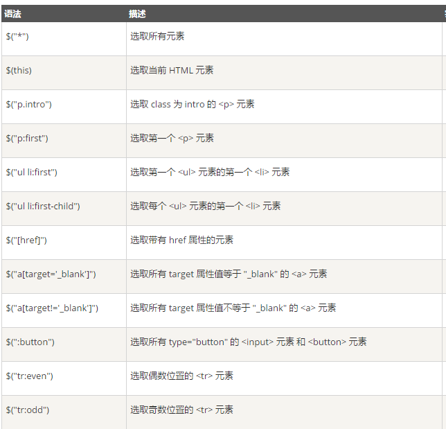

# JQuery教程

[菜鸟教程：JQuery教程](http://www.runoob.com/jquery/jquery-tutorial.html)

+ JQuery是一个JavaScript库。
+ JQuery极大地简化了JavaScript编程。
+ JQuery很容易学习 。

## JQuery简介

### 什么是JQuery？

JQuery是一个JavaScript库。  
JQuery是一个轻量级的“写的少，做的多”的JavaScript库。  
JQuery库包含以下功能：

+ HTML元素选取
+ HTML元素操作
+ CSS操作
+ HTML事件函数
+ JavaScript特效和动画
+ HTML DOM遍历和修改
+ AJAX
+ Utilities

>除此之外，JQuery还提供了大量的插件。

## JQuery语法

通过JQuery，可以选择HTML元素，并对它们执行操作。

### 基础语法

>$(selector).action()

+ 美元符号$定义JQuery
+ 选择符(selector)查询和查找HTML元素 
+ JQuery的action执行对元素的操作

例子：

+ $(this).hide()-隐藏当前元素
+ $("p").hide()-隐藏所有<p\>元素
+ $("p.test").hide()-隐藏所有class="test"的<p\>元素
+ $("#test").hide()-隐藏所有id="test"的元素

### 文档就绪事件

```js
$(document).ready(function(){
    // todo
});
```

这是为了防止文档在完全加载(就绪)之前执行JQuery代码。  
如果文档在没有完全加载之前就运行函数，操作可能失败。

比如：

+ 隐藏一个不存在的元素
+ 获得未完全加载的图像的大小

>提示 ：简洁写法

```js
$(function(){
    // todo
});
```

## JQuery选择器

JQuery选择器允许对HTML元素组或单个元素进行操作。  
JQuery选择器基于元素的id、类、类型、属性、属性值等查找HTML元素。它基于已经存在的CSS选择器，除此之外，还可以自定义选择器。  
JQuery选择器都以美元符号$开头。

### 元素选择器

JQuery元素选择器基于元素名选取元素。  
在页面中选取所有<p\>元素

>$("p")

当用户点击按钮后，所有的<p\>元素都隐藏：

```js
$(function(){
    $("button").click(function(){
        $("p").hide();
    });
});
```

### \#id 选择器

JQuery #id选择器通过HTML元素的id属性选取指定的元素。  
页面中元素的id应该是唯一的，所以在页面中选取唯一的元素需要通过#id选择器。  

通过id选取元素：

>$("#test")

当用户点击按钮后，id="test"的元素将被隐藏：

```js
$(function(){
    $("button").click(function(){
        $("#test").hide();
    });
});
```

### \.class 选择器

JQuery类选择器可以通过指定的class查找元素

语法如下：

>$(".test")

当用户点击按钮后，所有class="test"的元素都将被隐藏：

```js
$(function(){
    $("button").click(function(){
        $(".test").hide();
    });
});
```




