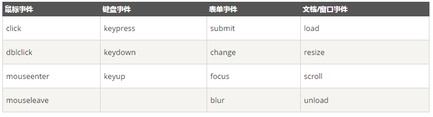

# JQuery教程

[菜鸟教程：JQuery教程](http://www.runoob.com/jquery/jquery-tutorial.html)

+ JQuery是一个JavaScript库。
+ JQuery极大地简化了JavaScript编程。
+ JQuery很容易学习 。

## JQuery简介

### 什么是JQuery？

JQuery是一个JavaScript库。  
JQuery是一个轻量级的“写的少，做的多”的JavaScript库。  
JQuery库包含以下功能：

+ HTML元素选取
+ HTML元素操作
+ CSS操作
+ HTML事件函数
+ JavaScript特效和动画
+ HTML DOM遍历和修改
+ AJAX
+ Utilities

>除此之外，JQuery还提供了大量的插件。

## JQuery语法

通过JQuery，可以选择HTML元素，并对它们执行操作。

### 基础语法

>$(selector).action()

+ 美元符号$定义JQuery
+ 选择符(selector)查询和查找HTML元素 
+ JQuery的action执行对元素的操作

例子：

+ $(this).hide()-隐藏当前元素
+ $("p").hide()-隐藏所有<p\>元素
+ $("p.test").hide()-隐藏所有class="test"的<p\>元素
+ $("#test").hide()-隐藏所有id="test"的元素

### 文档就绪事件

```js
$(document).ready(function(){
    // todo
});
```

这是为了防止文档在完全加载(就绪)之前执行JQuery代码。  
如果文档在没有完全加载之前就运行函数，操作可能失败。

比如：

+ 隐藏一个不存在的元素
+ 获得未完全加载的图像的大小

>提示 ：简洁写法

```js
$(function(){
    // todo
});
```

## JQuery选择器

JQuery选择器允许对HTML元素组或单个元素进行操作。  
JQuery选择器基于元素的id、类、类型、属性、属性值等查找HTML元素。它基于已经存在的CSS选择器，除此之外，还可以自定义选择器。  
JQuery选择器都以美元符号$开头。

### 元素选择器

JQuery元素选择器基于元素名选取元素。  
在页面中选取所有<p\>元素

>$("p")

当用户点击按钮后，所有的<p\>元素都隐藏：

```js
$(function(){
    $("button").click(function(){
        $("p").hide();
    });
});
```

### \#id 选择器

JQuery #id选择器通过HTML元素的id属性选取指定的元素。  
页面中元素的id应该是唯一的，所以在页面中选取唯一的元素需要通过#id选择器。  

通过id选取元素：

>$("#test")

当用户点击按钮后，id="test"的元素将被隐藏：

```js
$(function(){
    $("button").click(function(){
        $("#test").hide();
    });
});
```

### \.class 选择器

JQuery类选择器可以通过指定的class查找元素

语法如下：

>$(".test")

当用户点击按钮后，所有class="test"的元素都将被隐藏：

```js
$(function(){
    $("button").click(function(){
        $(".test").hide();
    });
});
```


## JQuery事件

JQuery是为事件处理特别设计的。

什么是事件？

页面对不同访问者的响应叫做事件。  
事件处理程序指的是当HTML中发生某些事件时所调用的方法。

例如：

+ 在元素上移动鼠标
+ 选取单选按钮
+ 点击元素

在事件中经常使用术语“触发”，例如：当按下按键时触发keypress事件。

常见DOM事件：



JQuery事件方法语法

在JQuery中，大多数DOM事件都有一个等效的JQuery方法。  
页面中指定一个点击事件：  

>$("p").click()

下一步是定义什么时间触发事件。可以通过一个事件函数实现：

```js
$("p").click(function(){
    // todo
});
```

### 常用JQuery事件方法

#### \$(docunment).ready()  

$(document).ready()允许在文档完全加载完后执行函数。

### click()

click()是当按钮点击事件被触发时会调用的一个函数。  
该函数在用户点击HTML元素的时候执行。  

当点击事件在某个<p\>元素上触发时，隐藏当前的<p\>元素：  

```js
$("p").click(function(){
    $(this).hide();
});
```

#### dbclick()

当双击元素时，会发生dbclick事件。  
dbclick()触发dbclick事件，或规定当发生dbclick事件时运行的函数：  

```js
$("p").dbclick(function(){
    $(this).hide();
});
```

#### mouseenter()

当鼠标指针穿过元素时，会触发mouseenter事件。  
mouseenter()触发mouseenter事件，或规定当发生mouseenter事件时运行的函数。

```js
$("#p1").mouseenter(function(){
    alert("鼠标移到了元素上");
});
```

#### mouseleave()

当鼠标指针离开元素时，会发生mouseleave事件。  
mouseleave()方法触发mouseleave事件，或规定当发生mouseleave事件时运行的函数：

```js
$("#p1").mouseleave(function(){
    alert("鼠标指针离开元素");
});
```

#### mousedown()

当鼠标指针移动到元素上方，并按下鼠标按键时，会发生mousedown事件。  
mousedown()触发mousedown事件，或规定当发生mousedown事件时运行的函数：

```js
$("#p1").mousedown(function(){
    alert("鼠标在该元素上按下");
});
```

#### mouseup()

当在元素上松开鼠标按钮时，会发生mouseup事件。  
mouseup()触发mouseup事件，或规定当发生mouseup事件时运行的函数：

```js
$("#p1").mouseup(function(){
    alert("鼠标在元素上松开");
});
```

#### hover()

hover()用于模拟光标悬停事件。  
当鼠标移动到元素上时，会触发指定的第一个函数(mouseenter)；当鼠标移出这个元素时，会触发指定的第二个函数(mouseleave)。

```js
$("#p1").hover(
    function(){
        alert("mouseenter");
    },
    function(){
        alert("mouseleave");
    }
);
```

#### focus()

当元素获得焦点时，发生focus事件。  
当通过鼠标点击选中元素或通过tab键定位到元素时，该元素就会获得焦点。  
focus()触发focus事件，或规定当发生focus事件时运行的函数：

```js
$("input").focus(function(){
    $(this).css("background-color","#FFF");
});
```

#### blur()

当元素失去焦点时，发生blur事件。  
blur()触发blur事件，或规定当发生blur事件时运行函数：

```js
$("input").blur(function(){
    $(this).css("background-color","#fff");
});
```


