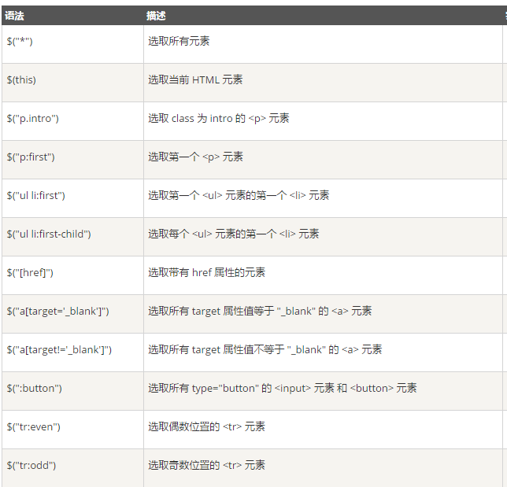
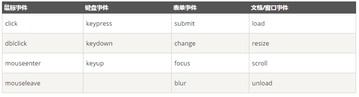
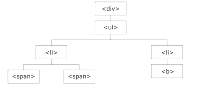

# jQuery教程

[菜鸟教程：jQuery教程](http://www.runoob.com/jquery/jquery-tutorial.html)

+ jQuery是一个JavaScript库。
+ jQuery极大地简化了JavaScript编程。
+ jQuery很容易学习 。

## jQuery简介

### 什么是jQuery？

jQuery是一个JavaScript库。

jQuery是一个轻量级的“写的少，做的多”的JavaScript库。

jQuery库包含以下功能：

+ HTML元素选取
+ HTML元素操作
+ CSS操作
+ HTML事件函数
+ JavaScript特效和动画
+ HTML DOM遍历和修改
+ AJAX
+ Utilities

>除此之外，jQuery还提供了大量的插件。

## jQuery语法

通过jQuery，可以选择HTML元素，并对它们执行操作。

### 基础语法

>$(selector).action()

+ 美元符号$定义jQuery
+ 选择符(selector)查询和查找HTML元素
+ jQuery的action执行对元素的操作

例子：

+ $(this).hide()-隐藏当前元素
+ $("p").hide()-隐藏所有<p\>元素
+ $("p.test").hide()-隐藏所有class="test"的<p\>元素
+ $("#test").hide()-隐藏所有id="test"的元素

### 文档就绪事件

```js
$(document).ready(function(){
    // todo
});
```

这是为了防止文档在完全加载(就绪)之前执行jQuery代码。

如果文档在没有完全加载之前就运行函数，操作可能失败。

比如：

+ 隐藏一个不存在的元素
+ 获得未完全加载的图像的大小

>提示 ：简洁写法

```js
$(function(){
    // todo
});
```

## jQuery选择器

jQuery选择器允许对HTML元素组或单个元素进行操作。

jQuery选择器基于元素的id、类、类型、属性、属性值等查找HTML元素。它基于已经存在的CSS选择器，除此之外，还可以自定义选择器。

jQuery选择器都以美元符号$开头。

### 元素选择器

jQuery元素选择器基于元素名选取元素。

在页面中选取所有<p\>元素

>$("p")

当用户点击按钮后，所有的<p\>元素都隐藏：

```js
$(function(){
    $("button").click(function(){
        $("p").hide();
    });
});
```

### \#id 选择器

jQuery #id选择器通过HTML元素的id属性选取指定的元素。

页面中元素的id应该是唯一的，所以在页面中选取唯一的元素需要通过#id选择器。

通过id选取元素：

>$("#test")

当用户点击按钮后，id="test"的元素将被隐藏：

```js
$(function(){
    $("button").click(function(){
        $("#test").hide();
    });
});
```

### \.class 选择器

jQuery类选择器可以通过指定的class查找元素

语法如下：

>$(".test")

当用户点击按钮后，所有class="test"的元素都将被隐藏：

```js
$(function(){
    $("button").click(function(){
        $(".test").hide();
    });
});
```



## jQuery事件

jQuery是为事件处理特别设计的。

什么是事件？

页面对不同访问者的响应叫做事件。

事件处理程序指的是当HTML中发生某些事件时所调用的方法。

例如：

+ 在元素上移动鼠标
+ 选取单选按钮
+ 点击元素

在事件中经常使用术语“触发”，例如：当按下按键时触发keypress事件。

常见DOM事件：



jQuery事件方法语法

在jQuery中，大多数DOM事件都有一个等效的jQuery方法。

页面中指定一个点击事件：

>$("p").click()

下一步是定义什么时间触发事件。可以通过一个事件函数实现：

```js
$("p").click(function(){
    // todo
});
```

### 常用jQuery事件方法

#### \$(docunment).ready()

$(document).ready()允许在文档完全加载完后执行函数。

### click()

click()是当按钮点击事件被触发时会调用的一个函数。

该函数在用户点击HTML元素的时候执行。

当点击事件在某个<p\>元素上触发时，隐藏当前的<p\>元素：

```js
$("p").click(function(){
    $(this).hide();
});
```

#### dbclick()

当双击元素时，会发生dbclick事件。

dbclick()触发dbclick事件，或规定当发生dbclick事件时运行的函数：

```js
$("p").dbclick(function(){
    $(this).hide();
});
```

#### mouseenter()

当鼠标指针穿过元素时，会触发mouseenter事件。

mouseenter()触发mouseenter事件，或规定当发生mouseenter事件时运行的函数。

```js
$("#p1").mouseenter(function(){
    alert("鼠标移到了元素上");
});
```

#### mouseleave()

当鼠标指针离开元素时，会发生mouseleave事件。

mouseleave()方法触发mouseleave事件，或规定当发生mouseleave事件时运行的函数：

```js
$("#p1").mouseleave(function(){
    alert("鼠标指针离开元素");
});
```

#### mousedown()

当鼠标指针移动到元素上方，并按下鼠标按键时，会发生mousedown事件。

mousedown()触发mousedown事件，或规定当发生mousedown事件时运行的函数：

```js
$("#p1").mousedown(function(){
    alert("鼠标在该元素上按下");
});
```

#### mouseup()

当在元素上松开鼠标按钮时，会发生mouseup事件。

mouseup()触发mouseup事件，或规定当发生mouseup事件时运行的函数：

```js
$("#p1").mouseup(function(){
    alert("鼠标在元素上松开");
});
```

#### hover()

hover()用于模拟光标悬停事件。

当鼠标移动到元素上时，会触发指定的第一个函数(mouseenter)；当鼠标移出这个元素时，会触发指定的第二个函数(mouseleave)。

```js
$("#p1").hover(
    function(){
        alert("mouseenter");
    },
    function(){
        alert("mouseleave");
    }
);
```

#### focus()

当元素获得焦点时，发生focus事件。

当通过鼠标点击选中元素或通过tab键定位到元素时，该元素就会获得焦点。

focus()触发focus事件，或规定当发生focus事件时运行的函数：

```js
$("input").focus(function(){
    $(this).css("background-color","#FFF");
});
```

#### blur()

当元素失去焦点时，发生blur事件。

blur()触发blur事件，或规定当发生blur事件时运行函数：

```js
$("input").blur(function(){
    $(this).css("background-color","#fff");
});
```

## jQuery效果

### 隐藏和显示

#### hide()和show()

可以使用hide()和show()来隐藏或显示HTML元素：

```js
$("p").hide();
```

```js
$("p").show();
```

语法如下：

>$(selector).hide(speed,callback);
>$(selector).show(speed,callback);

可选的speed参数规定隐藏/显示的速度，可以取以下值："slow","fast"或毫秒。

可选的callback参数是隐藏或显示完成后所执行的函数名称。

```js
$("p").hide(1000);
```

#### toggle()

可以使用toggle()来切换hide()和show()。

显示被隐藏的元素，并隐藏已显示的元素：

```js
$("p").toggle();
```

语法如下：

>$(selector).toggle(speed,callback);

可选的speed参数规定隐藏/显示的速度，可以取以下值："slow","fast"或毫秒。

可选的callback参数是隐藏或显示完成后所执行的函数名称。

### 淡入淡出

jQuery Fadding方法

通过jQuery可以实现元素的淡入淡出效果。

jQuery拥有下面四种fade方法：

+ fadeIn()
+ fadeOut()
+ fadeToggle()
+ fadeTo()

#### jQuery fadeIn()

jQuery fadeIn()用于淡入已隐藏的元素。

语法如下：

>$(selector).fadeIn(speed,callback);

可选的speed参数规定效果的时长。它可以取以下值："slow"，"fast"或毫秒。

可选的callback参数是fading完成后所执行的函数名称。

带有不同参数的fadeIn()：

```js
$("button").click(function(){
    $("#div1").fadeIn();
    $("#div2").fadeIn("slow");
    $("#div3").fadeIn(3000);
});
```

#### jQuery fadeOut()

jQuery fadeOut()用于淡出可见元素。

语法如下：

>$(selector).fadeOut(speed,callback);

可选的speed参数规定效果的时长。它可以取以下值："slow"，"fast"或毫秒。

可选的callback参数是fading完成后所执行的函数名称。

可选的callback参数是fading完成后所执行的函数名称。

带有不同参数的fadeOut()：

```js
$("button").click(function(){
    $("#div1").fadeOut();
    $("#div2").fadeOut("slow");
    $("#div3").fadeOut(3000);
});
```

#### jQuery fadeToggle()

jQuery fadeToggle()可以在fadeIn()和fadeOut()之间切换。

如果元素已淡出，则fadeToggle()会向元素添加淡入效果。

如果元素已淡入，则fadeToggle()会向元素添加淡出效果。

语法如下：

>$(selector).fadeToggle(speed,callback);

带有不同参数的fadeToggle()：

```js
$("button").click(function(){
    $("#div1").fadeToggle();
    $("#div2").fadeToggle("slow");
    $("#div3").fadeToggle(3000);
});
```

#### jQuery fadeTo()

jQuery fadeTo()允许渐变为给定的不透明度(值介于0和1之间)。

语法如下：

>$(selector).fadeTo(speed,opacity,callback);

必需的speed参数规定效果的时长。它可以取以下值："slow"，"fast"或毫秒。

fadeTo()必需的opacity参数将淡入淡出效果设置为给定的不透明度(值介于0与1之间)。

可选的callback参数是fading完成后所执行的函数名称。

带有不同参数的fadeTo()：

```js
$("button").click(function(){
    $("#div1").fadeTo("slow",0.15);
    $("#div2").fadeTo("slow",0.4);
    $("#div3").fadeTo("slow",0.7);
});
```

### 滑动

通过jQuery，可以在元素上创建滑动效果。

jQuery有以下滑动方法：

+ slideDown()
+ slideUp()
+ slideToggle()

#### slideDown()

jQuery slideDown()用于向下滑动元素。

语法如下：

>$(selector).slideDown(speed,callback);

可选的speed参数规定效果的时长。它可以取以下值："slow"，"fast"或毫秒。

可选的callback参数是滑动完成后所执行的函数名称。

例子：

```js
$("#flip").click(function(){
    #("#panel").slideDown();
});
```

#### slideUp()

jQuery slideUp()用于向上滑动元素。

语法如下：

>$(selector).slideUp(speed,callback);

可选的speed参数规定效果的时长。它可以取以下值："slow"，"fast"或毫秒。

可选的callback参数是滑动完成后所执行的函数名称。

例子：

```js
$("#flip").click(function(){
    #("#panel").slideUp();
});
```

#### slideToggle()

slideToggle()可以在slideDown()和slideUp()之间切换。

如果元素向下滑动，则slideToggle()向上滑动。

如果元素向上滑动，则slideToggle()向下滑动。

>$(selector).slideToggle(speed,callback);

可选的speed参数规定效果的时长。它可以取以下值："slow"，"fast"或毫秒。

可选的callback参数是滑动完成后所执行的函数名称。

例子：

```js
$("#flip").click(function(){
    $("#panel").slideToggle();
});
```

### 动画

jQuery animate()允许创建自定义的动画。

#### animate()方法

语法：

>$(selector).animate({params},speed,callback);

必需的params参数定义形成动画的css属性。

可选的speed参数规定效果的时长。可以取以下值："slow"，"fast"或毫秒。

可选的callback参数是动画完成后执行的函数名称。

把<div\>元素往右边移动250像素：

```js
$("button").click(function(){
    $("div").animate({left:'250px'});
});
```

#### animate()-操作多个属性

生成动画的过程中可以使用多个属性：

```js
$("button").click(function(){
    $("div").animate({
        left:'250px',
        opacity:'0.5',
        height:'150px',
        width:'150px'
    });
});
```

>几乎可以使用animate()操作所有css属性。需要注意的是：必须使用Camel标记法书写所有属性名，比如，paddingLeft而不是padding-left。

#### animate()-使用相对值

可以定义相对值(该值相对于元素的当前值)。需要在值的前面加上+或-：

```js
$("button").click(function(){
    $("div").animate({
        left:'250px',
        height:'+=150px',
        widthL'+=150px'
    });
});
```

#### animate()-使用预定义的值

可以把属性的动画值设置为"show"，"hide"或"toggle"。

```js
$("button").click(function(){
    $("div").animate({
        height:"toggle"
    });
});
```

#### animate()-使用队列功能

jQuery默认提供针对动画的队列功能。

编写多个animate()调用，jQuery会创建包含这些方法调用的"内部"队列。然后逐一运行这些animate调用。

```js
$("button").click(function(){
    var div=$("div");
    div.animate({height:'300px',opacity:'0.4'},"slow");
    div.animate({width:'300px',opacity:'0.8'},"slow");
    div.animate({height:'100px',opacity:'0.4'},"slow");
    div.animate({width:'100px',opacity:'0.8'},"slow");
});
```

把<div\>元素往右边移动了100像素，然后增加文本的字号：

```js
$("button").click(function(){
    var div=$("div")l
    div.animate({left:'100px'},"slow");
    div.animate({fontSize:'3em'}."slow");
});
```

### 停止动画

#### stop()

jQuery stop()用于停止动画或效果，在它们完成之前。

stop()适用于所有的jQuery效果函数，包括滑动、淡入淡出和自定义动画。

语法：

>$(selector).stop(stopAll,goToEnd);

可选的stopAll参数规定是否应该清除动画队列。默认是false，即停止活动的动画，允许任何排入队列的动画向后执行。

可选的goToEnd参数规定是否立即完成当前动画，默认是false。

因此，默认地，stop()会清除在被选元素上指定的当前动画。

```js
$("#stop").click(function(){
    $("#panel").stop();
});
```

### Callback方法

Callback函数在当前动画100%完成之后执行。

#### jQuery动画的问题

许多jQuery函数涉及动画，这些函数会将speed或duration作为可选参数。

>例如：$("p").hide("slow");

speed或duration参数可以设置许多不同的值，比如"slow"，"fast"，"normal"或毫秒。

以下实例在隐藏效果完全实现后回调函数：

```js
$("button").click(function(){
    $("p").hide("slow",function(){
        alert("段落隐藏");
    });
});
```

以下实例没有回调函数，警告框会在隐藏效果完成前弹出：

```js
$("button").click(function(){
    $("p").hide("slow");
    alert("段落隐藏");
});
```

### 链

通过jQuery，可以把动作/方法链接在一起。

Chaining允许在一条语句中运行多个jQuery方法(在相同的元素上)。

#### 方法链接

如需链接一个动作，只需简单地把该工作追加到之前的动作上。

下面例子把css()、slideUp()、和slideDown()链接在一起。"p1"元素首先会变为红色，然后向上滑动，再然后向下滑动：

```js
$("#p1").css("color":"red").slideUp(2000).slideDown(2000);
```

## jQuery HTML

### 获取内容和属性

#### jQuery DOM操作

jQuery中非常重要的部分，就是操作DOM的能力。

jQuery提供一系列与DOM相关的方法，这使得访问和操作元素和属性变得很容易。

>DOM = Document Object Model(文档对象模型)

DOM定义访问HTML和XML文档的标准："W3C文档对象模型独立于平台和语言的界面，允许程序和脚本动态访问和更新文档的内容、结构以及样式。"

#### 获得内容-text()、html()以及val()

三个简单实用的用于DOM操作的jQuery方法：

+ text()-设置或返回所选元素的文本内容
+ html()-设置或返回所选元素的内容
+ val()-设置或返回表单字段的值

通过jQuery text()和html()方法获得内容：

```js
$("#btn1").click(function(){
    alert("Text: "+$("#test").text());
});
$("#btn2").click(function(){
    alert("HTML: "+$("#test").text());
});
```

通过jQuery val()获得输入字段的值：

```js
$("#btn1").click(function(){
    alert("值为： "+$("#test").val());
});
```

#### 获取属性-attr()

jQuery attr()用于获取属性值。

获得链接中href属性的值：

```js
$("button").click(function(){
    alert($("#link").attr("href"));
});
```

### 设置

#### 设置内容-text()、html()以及val()

通过jQuery的三个方法设置内容：

+ text()-设置或返回所选元素的文本内容
+ html()-设置或返回所选元素的内容(包括HTML标记)
+ val()-设置或返回表单字段的值

例子：

```js
$("#btn1").click(function(){
    $("#test1").text("Hello World!");
});
$("#btn2").click(function(){
    $("#test2").html("<b>Hello World!</b>");
});
$("#btn3").click(function(){
    $("#test3").val("Hello World!");
});
```

#### text()、html()的回调函数

回调函数有两个参数：

+ 被选元素列表中当前元素的下标
+ 原始的值

回调函数会以函数新值返回希望使用的字符串。

#### 带有回调函数的text()和html()

```js
$("#btn1").click(function(){
    $("#test1").text(function(i,origText){
        return "旧文本："+origText+"新文本：Hello World! (index:"+i+")";
    });
});
$("#btn2").click(function(){
    $("#test2").html(function(i,origText){
        return "旧 html："+origText+"新 html：<b>Hello World!</b> (index:"+i+")";
    });
});
```

#### 设置属性-attr()

jQuery attr()用于设置或改变属性值

改变链接中href属性的值：

```js
$("button").click(function(){
    $("#link").attr("href","https://www.baidu.com");
});
```

attr()允许同时设置多个属性。

同时设置href和title属性：

```js
$("button").click(function(){
    $("#link").attr({
        "href","https://www.baidu.com",
        "title","百度"
    });
});
```

#### attr()的回调函数

attr()回调函数有两个参数：

+ 被选元素列表中当前元素的下标
+ 原始值

回调函数会以函数新值返回希望使用的字符串。

带有回调函数的attr()：

```js
$("button").click(function(){
    $("#link").attr(function(i,origValue){
        return origValue+"/jQuery";
    });
});
```

### 添加元素

通过jQuery，可以很容易地添加新元素/内容。

#### 添加新的HTML内容

添加新内容的四个jQuery方法：

+ append()-在被选元素的结尾插入内容。
+ prepend()-在被选元素的开头插入内容。
+ after()-在被选元素之后插入内容。
+ before()-在被选元素之前插入内容。

#### append()

jQuery append()在被选元素的结尾插入内容。

```js
$("p").append("追加文本");
```

#### prepend()

jQuery prepend()在被选元素的开头插入内容。

```js
$("p").prepend("在开头追加文本");
```

#### 通过append()和prepend()添加若干新元素

在上面例子中，只在被选元素的开头/结尾插入文本/HTML。

append()和prepend()能够通过参数接收无限数量的新元素。可以通过jQuery来生成文本/HTML，或者通过js代码和DOM元素。

可以创建若干元素，这些元素可以通过text/HTML、jQuery或者js/DOM来创建。然后通过append()把这些新元素追加到文本中(对prepend()同样有效)：

```js
function appendText(){
    var txt1="<p>文本1</p>";
    var txt2=$("<p></p>").text("文本2");
    var txt3=document.creatElement("p");
    txt3.innerHTML="文本3";
    $("body").append(txt1,txt2,txt3);
}
```

#### after()和before()

jQuery after()在被选元素之后插入内容。

jQuery before()在被选元素之前插入内容。

```js
$("img").after("在后面添加文本");

$("img").before("在前面添加文本");
```

#### 通过after()和before()添加若干新元素

在上面例子中，只在被选元素的之后/之前插入文本/HTML。

after()和before()能够通过参数接收无限数量的新元素。可以通过jQuery来生成文本/HTML，或者通过js代码和DOM元素。

可以创建若干元素，这些元素可以通过text/HTML、jQuery或者js/DOM来创建。然后通过after()把这些新元素追加到文本中(对before()同样有效)：

```js
function afterText(){
    var txt1="<p>文本1</p>";
    var txt2=$("<p></p>").text("文本2");
    var txt3=document.creatElement("p");
    txt3.innerHTML="文本3";
    $("body").after(txt1,txt2,txt3);
}
```

### 删除元素

#### remove()

jQuery remove()删除被选元素及其子元素。

```js
$("#div1").remove();
```

#### empty()

jQuery empty()删除被选元素的子元素。

```js
$("#div1").empty();
```

#### 过滤被删除的元素

jQuery remove()可以接受一个参数，允许对被删元素进行过滤。

该参数可以是任何jQuery选择器的语法。

删除class="italic"的所有<p\>元素：

```js
$("p").remove(".italic");
```

### CSS类

#### 获取并设置CSS类

jQuery拥有若干进行CSS操作的方法：

+ addClass()-向被选元素添加一个或多个类
+ removeClass()-从被选元素删除一个或多个类
+ toggleClass()-对被选元素进行添加/删除类的切换操作
+ css()-设置或返回样式属性

#### addClass()

向元素添加一个或多个class属性：

```js
$("button").click(function(){
    $("h1,h2").addClass("blue");
    $("h3,h4").addClass("blue important");
});
```

#### removeClass()

从元素删除一个或多个class属性：

```js
$("button").click(function(){
    $("h1").removeClass("blue");
    $("h3,h4").removeClass("blue important");
});
```

#### toggleClass()

对被选元素进行添加/删除类的切换操作：

```js
$("button").click(function(){
    $("h1,h2").toggleClass("blue important");
});
```

### css()

css()设置或返回被选元素的一个或多个样式属性。

#### 返回css属性

返回指定的css属性，使用如下语法：

>css("propertyname");

返回首个匹配元素的background-color的值：

```js
$("p").css("background-color");
```

#### 设置css属性

如需设置指定的css属性，使用如下语法：

>css("propertyname","value");

为所有匹配元素设置background-color属性：

```js
$("p").css("background-color","yellow");
```

#### 设置多个css属性

如需设置多个css属性，使用如下语法：

>css({"propertyname":"value","propertyname":"value"...});

为所有匹配元素设置background-color和font-size：

```js
$("p").css({
    "background-color":"yellow",
    "font-size":"200%"
});
```

### 尺寸

#### jQuery尺寸


#### width()和height()

width()设置或返回元素的宽度(不包括内边距、边框或外边距)。

height()设置或返回元素的高度(不包括内边距、边框或外边距)。

返回<div\>元素的宽度和高度：

```js
$("button").click(function(){
    var txt="";
    txt+="div的高度是："+$("#div1").width()+"</br>";
    txt+="div的宽度是："+$("#div1").height()+"</br>";
    $("#div1").html(txt);
});
```

#### innerWidth()和innerHeight()

innerWidth()设置或返回元素的宽度(包括内边距)。

innerHeight()设置或返回元素的高度(包括内边距)。

返回<div\>元素的innerWidth和innerHeight：

```js
$("button").click(function(){
    var txt="";
    txt+="div的宽度，包含内边距是："+$("#div1").innerWidth()+"</br>";
    txt+="div的高度，包含内边距是："+$("#div1").innerHeight()+"</br>";
    $("#div1").html(txt);
});
```

#### outerWidth()和outerHeight()

outerWidth()设置或返回元素的宽度(包括内边距和边框)。

outerHeight()设置或返回元素的高度(包括内边距和边框)。

返回<div\>元素的outerWidth和outerHeight：

```js
$("button").click(function(){
    var txt="";
    txt+="div的高度，包含内边距和边框是："+$("#div1").outerHeight()+"</br>";
    txt+="div的宽度，包含内边距和边框是："+$("#div1").outerWidth()+"</br>";
    $("#div1").html(txt);
});
```

## jQuery 遍历

### 什么是遍历？

用于根据其相对于其他元素的关系来查找HTML元素。以某项选择开始，并沿着这个选择移动，直到抵达您期望的元素为止。

通过jQuery遍历，能够从被选的元素开始，轻松地在家族树中向上移动(祖先)，向下移动(子孙)，水平移动(同胞)。这种移动被称为对DOM进行遍历。



图示解析：

+ <div\>元素时<ul\>的父元素，同时其中所有内容的祖先。
+ <ul\>元素时<li\>的父元素，同时是<div\>的子元素。
+ 左边的<li\>元素是<span\>的父元素，<ul\>的子元素，同时是<div\>的后代。
+ <span\>元素时<li\>的子元素，同时是<ul\>和<div\>的后代。
+ 两个<li\>元素时同胞(拥有相同的父元素)。
+ 右边的<li\>元素时<b\>的父元素，<ul\>的子元素，同时是<div\>的后代。
+ <b\>元素时右边的<li\>的子元素，同时是<ul\>和<div\>的后代。


