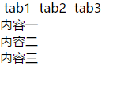

# JavaScript是实现Tab切换

>[脚本之家：javascript实现tab切换的四种方法](http://www.jb51.net/article/74395.htm)

```html
<!DOCTYPE html>
<html lang="en">

<head>
    <meta charset="UTF-8">
    <meta name="viewport" content="width=device-width, initial-scale=1.0">
    <meta http-equiv="X-UA-Compatible" content="ie=edge">
    <title>js实现tab切换</title>
    <style>
        * {
            padding: 0;
            margin: 0;
        }
        
        li {
            list-style: none;
            padding: 0 5px;
            float: left;
        }
        
        #tab {
            clear: both;
        }
    </style>
</head>

<body>
    <div id="tabContainer">
        <div id="tabNav">
            <ul>
                <li>tab1</li>
                <li>tab2</li>
                <li>tab3</li>
            </ul>
        </div>
        <div id="tab">
            <div id="tab1">内容一</div>
            <div id="tab2">内容二</div>
            <div id="tab3">内容三</div>
        </div>
    </div>
</body>

</html>
```



现在三个标签和三个内容区都显示在页面上，要实现点击标签一的时候显示内容一，其他内容不显示。

如何实现tab切换？

给所有的标签绑定点击事件，点击标签的时候，显示内容，其余隐藏。。。

```js
    <script>
        var tabs = ["tab1", "tab2", "tab3"];

        function tabChange(tabId) {
            for (var i = 0; i < tabs.length; i++) {
                var ele = document.getElementById(tabs[i]);
                if (tabId == tabs[i]) {
                    ele.style.display = "block";
                } else {
                    ele.style.display = "none";
                }
            }
        }
    </script>
```


